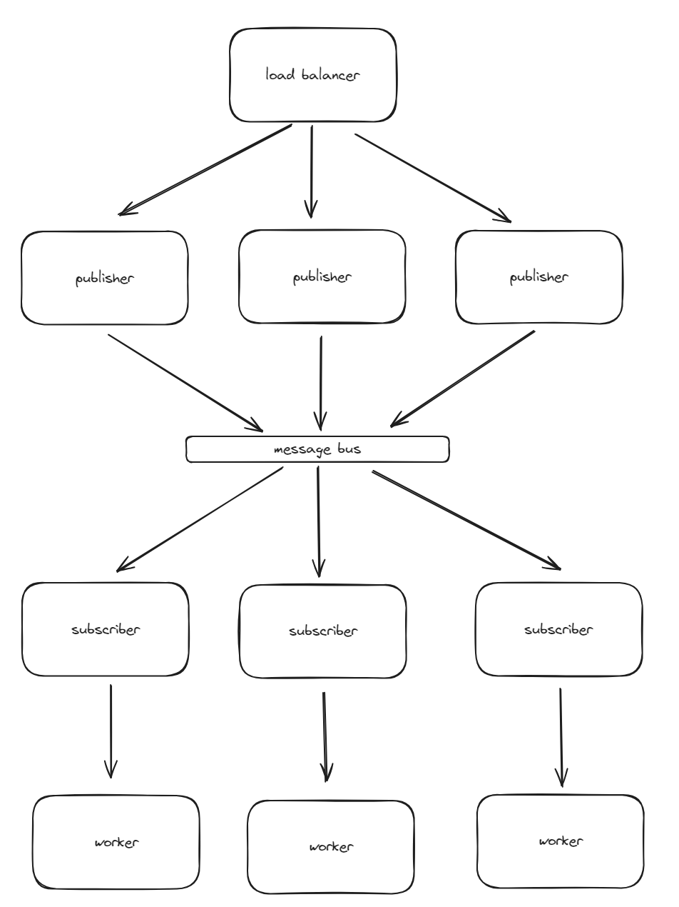

# Simple Distributed Architecture POC

## Overview

This project had two objectives:

1. Test the TILT development tool, which I now love.
2. Build a simple pub/sub model that I can iterate on in the future. 

## System Architecture




## How to run project

install TILT (https://docs.tilt.dev/):

```shell
    curl -fsSL https://raw.githubusercontent.com/tilt-dev/tilt/master/scripts/install.sh | bash
```

run TILT

```commandline
tilt up
```

#TODO fix this step

create a port forward to the load balancer service

```commandline
kubectl port-forward service/load-balancer 8080
```

run the test or navigate to the browser

```commandline
pytest -rP tests/
```